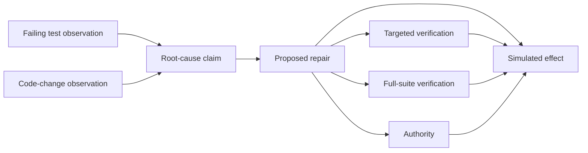

# Provenance runtime

A working first slice of the vacation idea: immutable evidence ancestry, current justification status, and an effect boundary that requires trusted verification and authority.

The runtime accepts provider-neutral claims and proposals. It records a simulated repo-repair effect only when its exact action hash has both required passing checks and matching, current authority. Invalidating an observation makes dependent justifications stale while preserving historical receipts.

## Run the demonstration

Python 3.12 or later, with no third-party dependencies. From this directory:

```powershell
python -m provenance demo --db :memory:
python -m unittest discover -s tests -v
```

On this computer, the confirmed Python runtime can be used directly:

```powershell
Set-Location 'C:\Users\bsema\Documents\Codex\2026-10-07\alr\outputs\provenance-runtime'
$provenancePython = 'C:\Users\bsema\.cache\codex-runtimes\codex-primary-runtime\dependencies\python\python.exe'
& $provenancePython -m provenance demo --db :memory:
```

For persistent inspection, pass a fresh path such as `demo.db`. The demonstration refuses a nonempty database without changing its records. A caller of the library may reopen its database and inspect or retry existing receipts.

The JSON report demonstrates:

- One simulated Effect and the same receipt on retry.
- A complete `why` ancestry containing two observations, a claim, an action, two verifications, and authority.
- An observation becoming INVALID, with its dependent action and historical justification becoming STALE.
- A fresh dependent action denied with code `STALE`, even when new verification and authority records are present.

The fixture uses a fixed clock and handwritten verification inputs. It runs no repository test suite and creates no actual PR. The project's automated tests exercise the runtime itself, including real subprocess termination at transaction boundaries.



## Library example

```python
from datetime import datetime, timedelta, timezone
from provenance import Store, Runtime, Policy, Parent, make_node, why, status

now = datetime(2026, 10, 7, tzinfo=timezone.utc)
policy = Policy(
    version="example-v1", subject="example:runtime",
    observers=("runner",), verifiers={"tester": ("targeted_tests", "full_suite")},
    issuers=("owner",), controllers=("owner",),
    requirements={"repo.repair.simulated": ("targeted_tests", "full_suite")},
)
with Store(":memory:") as store:
    runtime = Runtime(store, policy, lambda: now)
    observation = runtime.observe(runtime.observer("runner"), {"fixture": "failing test"})
    claim = runtime.submit(make_node(
        "Claim", {"statement": "a known change caused the failure"},
        [Parent("evidence", observation)], "reasoner", now,
    ))
    action = runtime.submit(make_node(
        "ProposedAction",
        {"action_type": "repo.repair.simulated", "resource": "example:repo", "arguments": {"patch": "repair"}},
        [Parent("justification", claim)], "reasoner", now,
    ))
    verifications = tuple(runtime.verify(runtime.verifier("tester"), action, check, True)
                          for check in ("targeted_tests", "full_suite"))
    authority = runtime.authorize(runtime.issuer("owner"), action, True, now + timedelta(hours=1))
    receipt = runtime.commit(action, verifications, authority)
    print(receipt.effect_id, receipt.justification_status)
    print([record.kind for record in why(store, receipt.effect_id).nodes])
    runtime.invalidate(runtime.controller("owner"), observation, "fixture evidence was incorrect")
    print(status(store, action, "execution"))  # STALE
```

Registered handles are issued to trusted application code. A model-facing adapter receives only `Runtime.submit` for Claim and ProposedAction nodes; it must not receive Runtime handles, database access, or arbitrary Python execution.

## Guarantees and boundaries

Nodes hash their canonical body and content-addressed parent references. SHA-256 commits to the whole reachable ancestry relative to the retained root ID. Validation detects changed bytes, absent ancestors, illegal typed edges, cycles, and inconsistent relationship indexes. It uses iterative graph traversal, including deep graphs.

Hashes do not prove factual truth or authenticate producer strings. The local host process and storage are trusted. The trusted-admission registry records the runtime API and principal that admitted observations, verification, authority, controls, and effects. It is local metadata, separate from portable hashes. This library is an application boundary for model-controlled records, not a sandbox against code running inside the host process or an attacker rewriting the entire database and its retained roots.

`commit` runs validation, current-status checks, required verifier checks, authority scope/expiry/revocation checks, and effect/mapping writes inside one SQLite write transaction. Competing commits serialize. A retry returns the existing local receipt and reports its current justification and integrity. Expired authority prevents a new action but does not erase a previously committed receipt. A corrupt historical receipt produces an integrity report rather than a new effect.

Exactly-once behavior here concerns a simulated effect inside one SQLite database. External effects need a durable intent/outbox, adapter idempotency, and recovery or reconciliation before integration.

## Queries and transfer

| API | Result |
| --- | --- |
| `store.validate(id)` | Integrity report with offending ancestor IDs. |
| `status(store, id, mode)` | VALID, INVALID, SUPERSEDED, or STALE. |
| `why(store, effect_id, mode)` | Immutable justification ancestry, current statuses, and later controls. |
| `evidence_for(store, claim_id)` | Supporting Claim/Observation ancestry, excluding the input claim. |
| `impacted_by(store, id)` | Sorted transitive causal dependent IDs. |
| `export_graph(store)` | Deterministic JSON bytes containing every historical record. |
| `import_graph(store, bytes)` | Atomic import; returns sorted imported IDs. |

Query node sequences use parent-before-child order with lexical ID tie-breaking. Current status is derived on demand, with INVALID taking precedence over SUPERSEDED and unusable causal parents making descendants STALE. Control target links commit to their targets but are not causal dependencies themselves.

The default `inspection` mode includes declared imported controls. `execution` applies locally admitted controls. Imports preserve bodies, hashes, relationships, inspection statuses, and historical receipts; they neither restore admission privileges nor populate the local commit mapping. A producer label in imported JSON grants no trust. Re-importing an existing local node does not downgrade its existing local admission. Imported records can be reissued deliberately through the trusted local runtime APIs; import alone never authorizes execution.

## Format 0.1

UTF-8 compact JSON with object keys ordered by Unicode scalar value, no BOM or Unicode normalization. Payload array order remains meaningful; parent references are sorted by role and ID and must be unique. Values are null, booleans, valid strings, lists, string-keyed objects, and integers within `[-(2^53-1), 2^53-1]`. Floats, duplicate input object keys, and unpaired surrogates are rejected.

Timestamps normalize to `YYYY-MM-DDTHH:MM:SS.ffffffZ`; a naive instant is rejected. The hash input is ASCII `provenance-runtime:node:0.1`, one LF byte, and the canonical body. Creation time is part of record identity. ID/hash is not included in its own body. Unknown versions fail closed; golden vectors freeze the 0.1 encoding so future readers retain the old validation path.

The approved design and implementation plan are under `docs/superpowers/`. Provider integrations, a custom language, scheduling, memory, distributed execution, and external effects remain future milestones.
